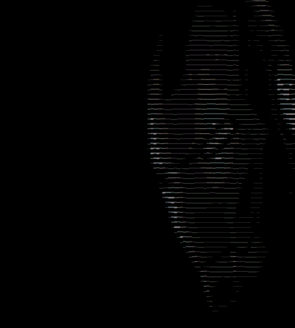

# ASCIIArt

# ASCIIArt

Using the Python Pillow module, convert an image into 2D array of RGB pixels. Now use these RGB values to determine a grayscale value of intensity (0-255) and based on this value, map it to an appropriate ASCII character that falls in the scaled range of that intensity. Resize the image to fit the commmand line.

